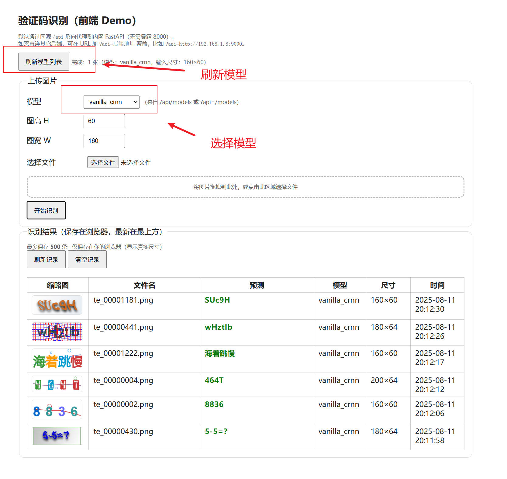

# deep-learning-captcha-ocr-tutorial

> 本项目是一个从 0 到 1 的验证码 OCR 教程与实战工程，重点覆盖数据生成 → 数据清洗与合并 → 模型训练与评估 → 在线推理与前端演示的完整闭环。
>
> 内置三类合成数据源（EasyCaptcha、CalculateCaptcha-Text、多数网站常见的 Ruoyi 风格），支持多尺寸、多字体、长度/类型/算术表达式分布可配置；训练侧提供 CRNN（Vanilla/ResNet34）与 SVTR-Tiny 的 CTC 识别方案；推理侧提供 FastAPI 接口，前端有 Flask 单页 Demo（支持拖拽上传、缩略图预览、本地历史记录、模型切换与尺寸显示）。适合学习与快速落地验证码识别系统。
>
> 仅供学习与研究，**不得用于任何非法用途**。

[](LICENSE)
[](https://www.python.org/)
[](https://pytorch.org/)
[](#step-1-ready-to-run开箱即用)

---

## ✨ 特性概览

- 数据合成可配置：支持 EasyCaptcha、CalculateCaptcha-Text、CalculateCaptcha-Ruoyi，多字体/多尺寸/长度分布/算术参与数、颜色扰动等可通过配置文件或脚本控制
- 数据清洗与合并：重复去重、标签统一、train/test 拆分与统计报表
- 多模型对比：Vanilla-CRNN、ResNet34-CRNN、SVTR-Tiny（CTC）统一数据接口与评估指标（EM、CER），训练可断点续训与连续多模型训练
- 端到端推理：FastAPI 服务 + Flask 前端（同源反代 /api，只需开放一个端口）

> 提示：仓库包含三种使用方式——Ready‑to‑Run / Train‑with‑Dataset / Build‑from‑Scratch，便于从入门到进阶循序学习。

## ✨ 支持的验证码风格（示例）

<p>
  
  
  
  
  
  
  
  
  
  
  
  
</p>
---

## ✨ 支持的验证码类型（EasyCaptcha）

| 类型 Key                                | 支持长度        | 支持字体                                                     |
| --------------------------------------- | --------------- | ------------------------------------------------------------ |
| 全小写字母验证码`spec`                  | 4, 5, 6         | Times New Roman, 微软雅黑, Noto Sans SC, 等线                |
| 数字+特殊字符验证码`spec_num`           | 4, 5, 6         | Times New Roman, 微软雅黑, Noto Sans SC, 等线                |
| 字母+特殊字符验证码`spec_char`          | 4, 5, 6         | Times New Roman, 微软雅黑, Noto Sans SC, 等线                |
| 全大写字母验证码`spec_upper`            | 4, 5, 6         | Times New Roman, 微软雅黑, Noto Sans SC, 等线                |
| 全小写字母验证码`spec_lower`            | 4, 5, 6         | Times New Roman, 微软雅黑, Noto Sans SC, 等线                |
| 数字+大写字母验证码`spec_numupper`      | 4, 5, 6         | Times New Roman, 微软雅黑, Noto Sans SC, 等线                |
| 数字+小写字母验证码`spec_numlower`      | 4, 5, 6         | Times New Roman, 微软雅黑, Noto Sans SC, 等线                |
| 动态 GIF 验证码`gif`                    | 4, 5, 6         | Times New Roman, 微软雅黑, Noto Sans SC, 等线                |
| 动态 GIF（数字+大写字母`gif_numupper`   | 4, 5, 6         | Times New Roman, 微软雅黑, Noto Sans SC, 等线                |
| 动态 GIF（数字+小写字母）`gif_numlower` | 4, 5, 6         | Times New Roman, 微软雅黑, Noto Sans SC, 等线                |
| 中文验证码`cn`                          | 4, 5            | 微软雅黑Times New Roman 宋体, 黑体, 等线, 仿宋, 楷体, Noto Sans SC, Noto Serif SC, 阿里巴巴普惠体 R, 华文宋体, 华文楷体, 方正舒体, 方正姚体 |
| 中文动态 GIF 验证码`cn_gif`             | 4, 5            | 微软雅黑, 宋体, 黑体, 等线, 仿宋, 楷体, Noto Sans SC, Noto Serif SC, 阿里巴巴普惠体 R, 华文宋体, 华文楷体, 方正舒体, 方正姚体 |
| 算术表达式验证码`arith`                 | 2, 3 (算式长度) | 微软雅黑, 宋体, 黑体, 等线, Noto Sans SC, Noto Serif SC, Microsoft JhengHei UI, 阿里巴巴普惠体 R, 华文宋体, 华文楷体 |

## ✨ 模型使用效果图

<p></p>

## ✨ 适用人群

- 想系统掌握验证码 OCR 实战的同学
- 需要快速搭建可用原型/对比多模型的工程师
- 想要自定义数据分布与风格来提升泛化能力的研究与落地团队

---

## 🚀 Step 1 · Ready‑to‑Run（开箱即用）

### 🛠️1.1 安装依赖

```powershell
# requirements.txt
torch>=2.3.0
Pillow>=10.2.0
fastapi>=0.111.0
uvicorn>=0.30.0
python-multipart>=0.0.9
```

### ⏳1.2 运行模型应用服务

```powershell
# 运行fastapi后端服务
uvicorn server_fastapi:app --host 0.0.0.0 --port 8000

# 运行flask前端服务
python server_flask.py --host 0.0.0.0 --port 8001

# （公网使用）运行flask前端服务，只把 8001 映射到公网
python server_flask.py --host 0.0.0.0 --port 8001 --upstream http://127.0.0.1:8000
```

## 🧪 Step 2 · Train‑with‑Dataset（本地训练）

### 📜2.1 训练集下载

- 通过123云盘的链接，https://www.123865.com/s/JpIZjv-mtrTd?pwd=5H8X# 提取码:5H8X，下载已生成好的训练图集，将图片解压至项目中dataset目录下。

- 删除项目中checkpoints目录下的所有文件。

### 📁2.2 安装依赖

```powershell
# pip install -r ./requirements.txt
torch>=2.3.0
torchvision>=0.18.0
albumentations>=1.4.0
opencv-python>=4.9.0
numpy>=1.26.0
Pillow>=10.2.0
tqdm>=4.66.0
rich>=13.7.0
pandas>=2.2.0
fastapi>=0.111.0
uvicorn>=0.30.0
python-multipart>=0.0.9
flask>=3.0.0
```

### ▶️2.3 训练模型命令

```powershell
# vanilla_crnn（基础 CRNN）
python train.py --arch vanilla_crnn --train-root dataset/train --val-root dataset/test \
  --imgH 60 --imgW 256 --pad-multiple 4 --downsample 4 --batch 192 --epochs 30 --aug --num-workers 1

# crnn_resnet34（ResNet34 特征）
python train.py --arch crnn_resnet34 --train-root dataset/train --val-root dataset/test \
  --imgH 60 --imgW 256 --pad-multiple 4 --downsample 4 --batch 192 --epochs 30 --aug --num-workers 1

# svtr_tiny（轻量视觉 Transformer）
python train.py --arch svtr_tiny --train-root dataset/train --val-root dataset/test \
  --imgH 60 --imgW 256 --pad-multiple 4 --downsample 4 --batch 192 --epochs 30 --aug --num-workers 1

# 一次性连续训练三种模型，人可以走开
python train.py --arch all --train-root dataset/train --val-root dataset/test \
  --imgH 60 --imgW 256 --pad-multiple 4 --downsample 4 --batch 192 --epochs 30 --aug --num-workers 1
```

✅ 批大小建议：`--batch 128`（更省显存）通常与 `--batch 192` 精度相近。若降至 `--batch 64`，建议适当增加 `--epochs`（+10–20%）以对齐效果。

💡若启用显卡训练，cuda 和pytorch版本须保持对应。

## 🧬 Step 3 · Build‑from‑Scratch（数据合成 → 训练 → 使用）

### 👉3.1 生成 EasyCaptcha 风格

```powershell
# 1. 编译
javac   -cp ".;lib/*" EasyCaptchaRunner.java
# 2. 列出
java -D"file.encoding=UTF-8"  -cp ".;lib/*"  EasyCaptchaRunner  list
# 3. 基于内置字体生成
java -D"file.encoding=UTF-8" -cp ".;lib/*"  EasyCaptchaRunner all out_all 10 160 64 0 --fonts builtin
# 4. 探测模式，各生成一张图片
java -Dfile.encoding=UTF-8 -cp ".;lib/*" EasyCaptchaRunner probejson config.json out_probe --samples 1 --threads 8
# 5. 基于config文件生成，混合在一起
java -Dfile.encoding=UTF-8 -cp ".;lib/*" EasyCaptchaRunner fromjson config.json out_easy_cfg 126000 --threads 8
# 6. 训练集200000张验证码混合生成
java  -D"file.encoding=UTF-8" -cp ".;lib/*" EasyCaptchaRunner fromjson config.json easy_train 200000  --threads 8
# 7. 测试集20000张验证码混合生成
java  -D"file.encoding=UTF-8" -cp ".;lib/*" EasyCaptchaRunner fromjson config.json easy_test 20000  --threads 8
```

✅ 省心建议：**# 1**编译后直接运行**# 6** 和 **# 7**生成训练集和测试集即可。

### 👉3.2  生成 CalcAllStyles_text 风格

```powershell
# 1. 编译
javac -encoding UTF-8 -cp "CalculateCaptcha-1.1.jar" CalcAllStylesRunner.java

# 2. 列出类型：
java -cp ".;CalculateCaptcha-1.1.jar" CalcAllStylesRunner list

# 3. 生成某一类型（例：水波/宽字距/无噪声，160x60，随机长度 4/5/6）
java -cp ".;CalculateCaptcha-1.1.jar" CalcAllStylesRunner gen text:water:wide:nonoise out_text_water_wide 10 160 60 0

# 4. 一口气生成全部文本类型（18 种组合)
java -cp ".;CalculateCaptcha-1.1.jar" CalcAllStylesRunner all out_all_text 10 160 60 0

# 5. 大规模生成训练集（162000张示例)
java -cp ".;CalculateCaptcha-1.1.jar" CalcAllStylesRunner smart ctext_train 162000   --fonts "Arial,Microsoft YaHei,SimSun,Noto Sans CJK SC"   --threads 8 
# 6.大规模生成测试集（16200张示例)
java -cp ".;CalculateCaptcha-1.1.jar" CalcAllStylesRunner smart ctext_test 16200   --fonts "Arial,Microsoft YaHei,SimSun,Noto Sans CJK SC"   --threads 8 
```

✅ 省心建议：**# 1**编译后直接运行**#5**和 **# 6**生成训练集和测试集即可。

### 👉3.3  生成 Ruoyi 风格

```powershell
# 1. 编译，这个方法是调用jar本身在做的生成，然后重新格式化，然后在删除文件，速度会比较慢
javac -encoding UTF-8 RuoyiJarNormalizeSmart.java

# 2. 生成训练集（自动尺寸分布；示例 100000 张，训练集；8 线程），
java -D"file.encoding=UTF-8" -cp ".;CalculateCaptcha-1.1.jar" RuoyiJarNormalizeSmart smart ruoyi_train 100000 --jar CalculateCaptcha-1.1.jar --sizes "160x60:40,180x64:20,200x64:15,256x64:10,120x40:10,96x32:5" --threads 8

# 3. 生成测试集（自动尺寸分布；示例 10000 张，测试集；8 线程）
java -D"file.encoding=UTF-8" -cp ".;CalculateCaptcha-1.1.jar" RuoyiJarNormalizeSmart smart ruoyi_test 10000 --jar CalculateCaptcha-1.1.jar --sizes "160x60:40,180x64:20,200x64:15,256x64:10,120x40:10,96x32:5" --threads 8
```

✅ 省心建议：**# 1**编译后直接运行**#2**和 **# 3**生成训练集和测试集即可。

### 👉3.4 合并与去重

调用merge_datasets.py 将三种类型的训练/测试集整合到一起：

```powershell
python tools\merge_datasets.py --train-dest dataset\train --test-dest dataset\test --train-src easy tools\java_captcha\EasyCaptcha\images\easy_train --train-src ctext tools\java_captcha\CalculateCaptch\images\ctext_train --train-src ruoyi tools\java_captcha\CalculateCaptch\images\ruoyi_train --test-src easy tools\java_captcha\EasyCaptcha\images\easy_test --test-src ctext tools\java_captcha\CalculateCaptch\images\ctext_test --test-src ruoyi tools\java_captcha\CalculateCaptch\images\ruoyi_test --copy-mode copy --dedupe --seed 123
```

> 提示：合并/去重可能较慢，耐心等待；确保磁盘有足够空间。
